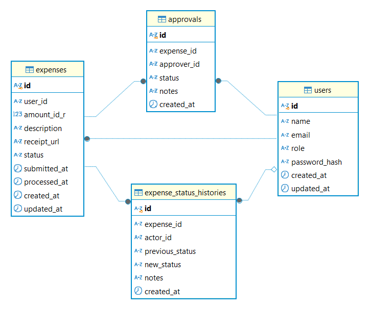

# Expense Management System

Aplikasi manajemen expense (Go + Nuxt) dengan PostgreSQL. Karyawan mengajukan pengeluaran dalam IDR, manager melakukan approval bila perlu, dan pengeluaran yang disetujui diproses pembayarannya melalui background worker (mock payment processor).

---

## Menjalankan dengan Docker (Disarankan)

```bash
docker compose up --build
```

Akses:

- Frontend: http://localhost:3000
- Backend: http://localhost:8080
- Health: http://localhost:8080/api/health

User default (hasil seeding):

- Employee: `john@mail.com` / `12345678`
- Manager: `manager@mail.com` / `12345678`

---

## Pengembangan Lokal

### Backend

```bash
cd backend
cp .env.example .env
go run ./cmd/web/main.go --migrate --seed --run
```

### Frontend

```bash
cd frontend
npm install
npm run dev
```

Buka: http://localhost:3000

---

## Testing

```bash
cd backend
go test ./...
```

Verbose:

```bash
cd backend
go test -v ./...
```

---

## Struktur Proyek

- `backend/` API Go (Gin + Gorm)
- `frontend/` Nuxt (Tailwind + DaisyUI)
- `docker-compose.yml` Full stack services
- `docs/` Dokumentasi (mis. skema DB & diagram arsitektur)

---

## Skema Database



---

## Backend Architecture (High-level)


Diagram ini menggambarkan pembagian layer di backend: **Config → Delivery (HTTP) → Use Case → Domain → Infrastructure (Repository/Gateway)**.  
Implementasi mengikuti clean architecture secara praktis; beberapa detail teknis (mis. ORM tags dan manajemen transaksi).

**Mapping folder ke layer (ringkas):**

- **Config**: `cmd/web`, `internal/config`, `internal/command`
- **Delivery**: `internal/delivery/http`
- **Use Case**: `internal/usecase`
- **Domain**: `internal/entity` (dan DTO di `internal/model` bila diperlukan)
- **Infrastructure**: `internal/repository`, `internal/integration`, `internal/background`, `internal/migrations`

---

# Expense Management System - Backend

Service backend Go dibangun dengan Gin + Gorm menggunakan gaya **clean architecture**.

## Tech Stack

- Go (lihat `go.mod`)
- Gin (HTTP)
- Gorm (PostgreSQL)
- Viper (config)
- Logrus (logging)
- Swaggo (Swagger UI)

## Setup Lokal

1. Copy env file:

```bash
cp .env.example .env
```

2. Jalankan migrasi + seeding + server (cara cepat):

```bash
go run ./cmd/web/main.go --migrate --seed --run
```

Default seed users:

- Employee: `john@mail.com` / `12345678`
- Manager: `manager@mail.com` / `12345678`

## Cara Menjalankan Backend (Mode Eksekusi)

> Pastikan sudah menyiapkan `.env` terlebih dahulu:

```bash
cp .env.example .env
```

### Mode Eksekusi

#### 🟢 Full Mode (Drop → Migrate → Seed → Run)

```bash
go run cmd/web/main.go --drop-table --migrate --seed --run
```

#### 🟡 Migrate → Seed → Run

```bash
go run cmd/web/main.go --migrate --seed --run
```

#### 🔵 Migrate + Run

```bash
go run cmd/web/main.go --migrate --run
```

#### 🟣 Hanya Menjalankan Server

```bash
go run cmd/web/main.go
```

#### 🧪 Hot Reload (Air)

```bash
air
```

Pastikan file `.air.toml` tersedia.

Server berjalan di:

```
http://localhost:8080
```

## Docker

Gunakan `docker-compose.yml` di root untuk menjalankan full stack:

```bash
docker compose up --build
```

## Environment Variables

- `APP_NAME`, `PORT`, `LOG_LEVEL`
- `DB_USERNAME`, `DB_PASSWORD`, `DB_HOST`, `DB_PORT`, `DB_NAME`
- `JWT_SECRET`, `JWT_ISSUER`, `JWT_AUDIENCE`, `JWT_EXPIRES_MINUTES`
- `PAYMENT_BASE_URL`, `PAYMENT_TIMEOUT_SECONDS`, `PAYMENT_RETRY_COUNT`, `PAYMENT_RETRY_DELAY_SECONDS`, `PAYMENT_QUEUE_BUFFER`
- `DROP_TABLE_NAMES` (dipisahkan koma)
- `CORS_ALLOW_ORIGINS` (dipisahkan koma), `CORS_ALLOW_CREDENTIALS`
- `RATE_LIMIT` (format mis. `100-M`)
- `RATE_LIMIT_EXCLUDE_PATHS` (dipisahkan koma; mendukung suffix `/*`)
- `SMTP_ENABLED`, `SMTP_HOST`, `SMTP_PORT`, `SMTP_USERNAME`, `SMTP_PASSWORD`
- `SMTP_FROM_EMAIL`, `SMTP_FROM_NAME`

## API Endpoints

- `POST /api/auth/login`
- `POST /api/auth/register` (helper untuk local usage)
- `POST /api/expenses` (auth)
- `GET /api/expenses` (auth, mendukung `status`, `page`, `size`)
- `GET /api/expenses/:id` (auth)
- `GET /api/expenses/:id/history` (auth)
- `PUT /api/expenses/:id/approve` (auth, manager only)
- `PUT /api/expenses/:id/reject` (auth, manager only)
- `GET /api/health`
- `GET /api/metrics`

## Business Rules

- Currency hanya IDR; amount disimpan sebagai integer.
- Minimal: IDR 10.000; maksimal: IDR 50.000.000.
- Expense >= IDR 1.000.000 memerlukan approval manager.
- Expense < IDR 1.000.000 auto-approved.
- Expense yang approved akan memicu background payment processing.
- Payment sukses akan mengubah status menjadi `completed`.
- Nilai status: `awaiting_approval`, `auto_approved`, `approved`, `rejected`, `completed`.
- Setiap perubahan status dicatat ke `expense_status_histories`.
- Expense yang butuh approval akan mengirim email notifikasi ke akun manager (SMTP dapat dikonfigurasi).

## Alur Approval & Payment

- Endpoint approve mengubah status menjadi `approved` **hanya jika** status saat ini `awaiting_approval`.
- Setelah approve, job pembayaran akan diantrikan (enqueue). Worker dapat memproses segera, sehingga GET berikutnya bisa cepat berubah menjadi `completed` jika mock payment sukses.
- Response approve dibuat sebelum payment selesai, sehingga response approve tetap mengembalikan status `approved` pada saat response.

## Payment Processor Mock

- Base URL: `https://1620e98f-7759-431c-a2aa-f449d591150b.mock.pstmn.io`
- Endpoint: `POST /v1/payments`
- Request body: `amount` (int), `external_id` (idempotency key)
- Mendukung idempotency ketika `external_id` sudah ada.

## Database Seeding

Seed files:

- `internal/migrations/json/users.json`
- `internal/migrations/json/expenses.json`
- `internal/migrations/json/approvals.json`
- `internal/migrations/json/expense_status_histories.json`

## Testing

```bash
go test ./...
```

Verbose:

```bash
go test -v ./...
```

## Swagger/OpenAPI

- Spec file: `api/openapi.yaml`
- Endpoint: `GET /api/openapi.yaml`
- Swagger UI: `GET /swagger/index.html`

## Catatan Arsitektur

- Gaya clean architecture dengan pemisahan layer: delivery, usecase, repository, entity.
- External services (payment, email) di-inject via interface agar mudah di-test.
- Logging terstruktur + centralized error handling.

## Asumsi

- Payment mock dianggap sukses jika mengembalikan HTTP 200 atau idempotent 400.
- Notifikasi email bersifat best-effort; jika gagal akan di-log dan tidak memblok request.

## Perbaikan ke Depan (Improvement)

- Tambah unit test business logic pada usecase.
- Tambah integration test untuk alur API (approve & payment).
- Tambah visibilitas background job (queue size, processing metrics).

---

# Expense Management System - Frontend

Frontend Nuxt menggunakan TailwindCSS + DaisyUI.

## Fitur

- Login dan register
- Dashboard expense dengan filter status dan pagination
- Form submit expense dengan format IDR + peringatan approval
- Antrian approval manager dengan approve/reject + notes
- Layout responsif dalam Bahasa Indonesia

## Setup

Install dependencies:

```bash
npm install
```

Jalankan dev server:

```bash
npm run dev
```

Buka http://localhost:3000

## Environment

- `NUXT_PUBLIC_API_BASE` (default `http://localhost:8080`)

## Production

```bash
npm run build
npm run preview
```

## Docker

Gunakan `docker-compose.yml` di root untuk menjalankan full stack:

```bash
docker compose up --build
```

## Notes

- Base URL API dapat dioverride melalui `NUXT_PUBLIC_API_BASE`.
- Pastikan backend sudah running sebelum menggunakan UI.

---

## License

Project ini menggunakan MIT License. Lihat file `LICENSE` untuk detail.
